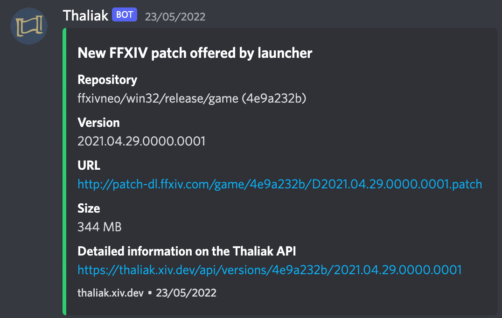

  

<h1 align="center" style="margin-top: 0px;">Thaliak</h1>

Thaliak is a Final Fantasy XIV patch tracking, notification, and analysis service.

A public version of the service is hosted at [thaliak.xiv.dev](https://thaliak.xiv.dev).
Most people will likely want to use the public version, but you can also use the code in this repository to self-host your own instance.

## Features
### Current
- Tracks game versions for FFXIV Global, Korea, and China
  - FFXIV Global uses a service account to log in and retrieve the patch list; all other regions do not require login to obtain the patch list
  - FFXIV Global will also scrape maintenance times from the Lodestone, and use that to determine when to poll more frequently for a new patch. 
- Provides a [GraphQL API](https://thaliak.xiv.dev/graphql) that can be consumed to retrieve patch information
- Provides a rudimentary [web interface](https://thaliak.xiv.dev) that displays patch information and API usage examples.
- Provides Discord webhook alerts. If you would like alerts set up in your own server, please [join the Thaliak Discord](https://discord.gg/3XwR35q29B) and request it. 

### Planned/Wanted
- Automatic summary of operations in ZiPatch files
- Automated disassembly of new game versions, including:
  - Checks for crucial signatures in [FFXIVClientStructs](https://github.com/aers/FFXIVClientStructs)
  - Executable strings tracking
  - ...and more?
- Automatic generation of patch index files for XIVLauncher
- Automatic creation of torrent files for patch downloads

## Community
Thaliak has [an official Discord server](https://discord.gg/3XwR35q29B) that serves as the primary place for service-related notifications.
If you are using the official Thaliak service in a production application, it's recommended that you join it and subscribe to the announcements channel.
You can also subscribe to the #patch-alerts channel, to receive notifications about new patches.

## Funding
There are some small recurring costs to maintaining the public Thaliak instance, including:
- A separate game subscription for FFXIV Global
- Server costs
- Storage costs

[Any assistance in covering these costs is appreciated, but not required.](https://github.com/sponsors/avafloww)
If you do decide to support Thaliak: thank you so much! 💙

## License
Thaliak is licensed under the [AGPL-3.0 license](LICENSE).

Thaliak uses some components from [XIVLauncher](https://github.com/avafloww/Thaliak/tree/main/lib).
These components are licensed under XIVLauncher's license.

##### FINAL FANTASY is a registered trademark of Square Enix Holdings Co., Ltd. FINAL FANTASY XIV © 2010-2023 SQUARE ENIX CO., LTD. All Rights Reserved. We are not affiliated with SQUARE ENIX CO., LTD. in any way.
